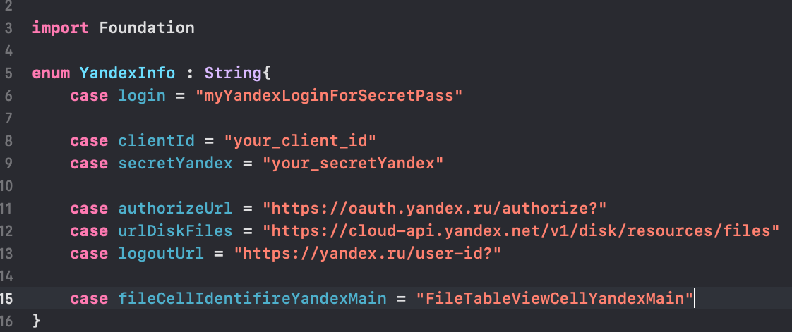
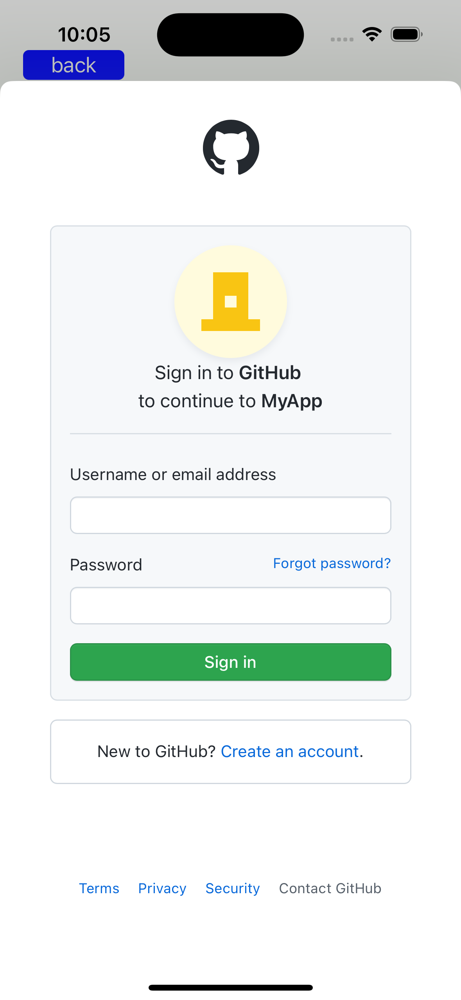
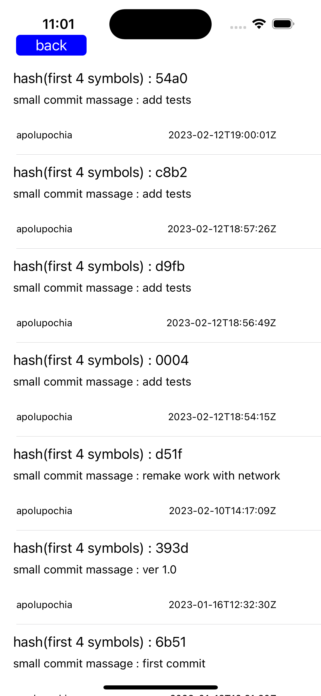
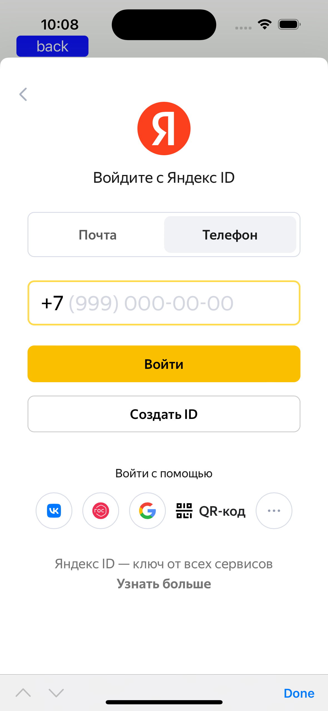
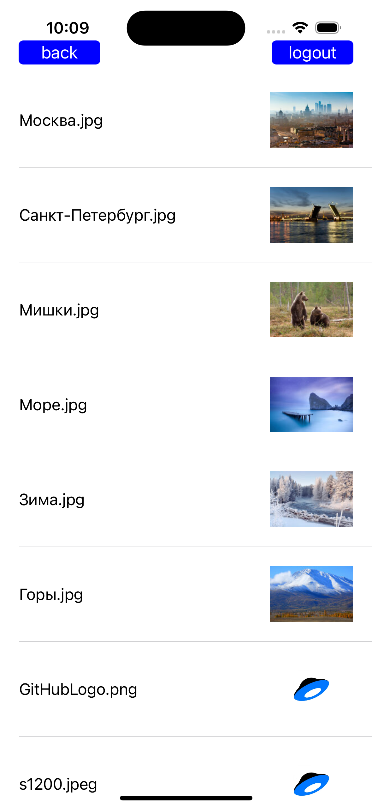

# GitHub and Yandex Disk oauth authorization
#### Change clientId and clientSecret (get it from you git app) or app won't work

#### Change clientId and secretYandex (get it from you yandex app) or app won't work

### Main selection screen

#### Login in Github

#### Your GitHub Repositories

#### GitHub information of repository 

#### Login in YandexDisk

#### Your Yandex photo

